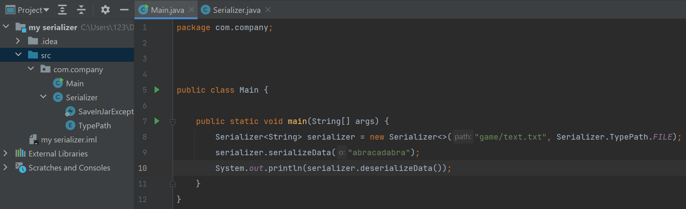
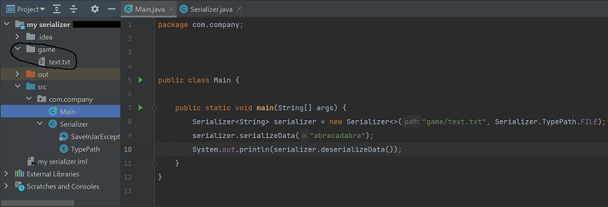
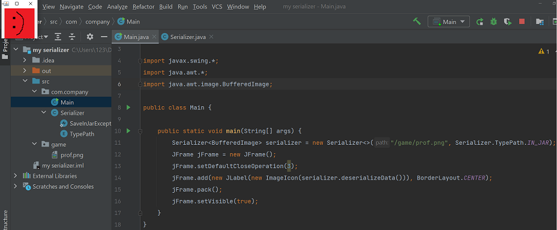

# Easy save and keep data
This class stores and takes data from the path you choose/Этот класс сохраняет и берёт информацию из выбранного вами пути

[EN](#en)/[RU](#ru)  

### Short description
the constructor of this class looks like
~~~ java
Serializer <T> serializer = new Serializer <> (String path, T defaultObject, Serializer.TypePath typeParh)
~~~
String path is responsible for the path to the PC / key for Preferences / path in the .jar file

T defaultObject is optional, it is used if the required file / key is not found and is returned instead (if defaultObject is not specified then null is returned) so that the program does not close.

Serializer.TypePath typeParh indicates the storage type (Preferences / file to PC / file to .jar file). All of them are listed below.
### Serializer.TypePath.PREFERENCES
Suitable for settings (login and password from the database), game saves (money, level, profile), etc.
~~~ java
Serializer <String> serializer = new Serializer <> ("value", Serializer.TypePath.PREFERENCES); // create serializer
serializer.serializeData ("abracadabra"); // save
System.out.println (serializer.deserializeData ()); // taking
~~~
> Console output:
> abracadabra

↑ This code saves the object we need thanks to [java.util.prefs.Preferences](https://java-course.ru/articles/preferences-api/) and we only need to save it once so that in subsequent launches it will have the same value by preference address (PREFERENCES). That is, at the second (and next) run of this code ↑, but without saving, the same will be displayed that was displayed the first time.
~~~ java
Serializer <String> serializer = new Serializer <> ("value", Serializer.TypePath.PREFERENCES); // create serializer
System.out.println (serializer.deserializeData ()); // taking
~~~
> Console output:
> abracadabra

Checking a default object:
~~~ java
// create serializer where the default object is the second argument of the constructor
Serializer <String> serializer = new Serializer <> ("value2", "DEFAULT", Serializer.TypePath.PREFERENCES);
System.out.println (serializer.deserializeData ());
~~~
> Console output:
> DEFAULT

It can also store an object of any type that implements serialization (For example: ArrayList or your own player profile). Example with ArrayList:
~~~ java
Serializer <ArrayList <Integer>> serializer = new Serializer <> ("list", Serializer.TypePath.PREFERENCES);
ArrayList <Integer> ints = new ArrayList <> ();
ints.add (0);
ints.add (1);
ints.add (3);
serializer.serializeData (ints);
System.out.println (serializer.deserializeData ());
~~~
> Console output:
> [0, 1, 3]

Example with a profile:
~~~ java
public class Main {
    static class Profile {// profile class written on the knee
        private int money = 10; // money
        public int getMoney () {return money; }//getter
        public void setMoney (int money) {this.money = money; }//setter
    }
    
    public static void main (String [] args) {
        Serializer <Profile> serializer = new Serializer <> ("profile", Serializer.TypePath.PREFERENCES);
        Profile profile = new Profile ();
        profile.setMoney (15);
        serializer.serializeData (profile);
        System.out.println (serializer.deserializeData (). GetMoney ());
    }
}
~~~
> Console output:
> 15

pros:
1) Free (main)
2) Values ​​are not visible through the decompiler

minuses:
1) The result may be saved when sending to another device (let's say you have 15 coins on your computer and after sending to your friend these coins may be saved), which is why you should reset all Prefernces before compiling the jar file. However, I have not checked and cannot confirm.
2) You can accidentally run out of memory (it will be difficult to do this, but still)

### Serializer.TypePath.FILE
Suitable for everything
~~~ java
Serializer <String> serializer = new Serializer <> ("C: //Users/123/Documents/text.txt", Serializer.TypePath.FILE);
serializer.serializeData ("abracadabra");
System.out.println (serializer.deserializeData ());
~~~
> Console output:
> abracadabra

From this you can conclude that Serializer.TypePath.FILE differs from Serializer.TypePath.PREFERENCES only in that Serializer.TypePath.FILE works with a file visible to everyone (PC Users). However, it has one feature that I really like. Let's say we want to store the object in a non-existent path. Since this all works through FileOutputStream, the usual code would throw exceptions, but my class in this case creates the necessary folders. Example:  
Before executing the code:  
  
After:  

as you can see the game folder was created automatically
### Serializer.TypePath.IN_JAR
It is only suitable for taking images (BufferedImage) from a jar file. To put images in a jar file, just place it in the src folder (if you work in IDEA, otherwise see [here](https://coderoad.ru/1096398/%D0%94%D0%BE%D0%B1%D0%B0%D0%B2%D0%B8%D1%82%D1%8C-%D0%B8%D0%B7%D0%BE%D0%B1%D1%80%D0%B0%D0%B6%D0%B5%D0%BD%D0%B8%D0%B5-%D0%B2-JAR-Java)). Example:  

### Краткое описание  
конструктор данного класса выглядит как  
~~~java
Serializer<T> serializer = new Serializer<>(String path, T defaultObject, Serializer.TypePath typeParh)
~~~  
String path отвечает за путь на ПК/ключ для Preferences/путь в .jar файле 

T defaultObject не обязателен, он используется если нужный файл/ключ не найден и возвращается вместо него (если defaultObject не указан то возвращается null), чтобы программа не закрылась.  

Serializer.TypePath typeParh указывает тип хранения (Preferences / файл на ПК/ файл в .jar файле). Все они расписаны ниже
### Serializer.TypePath.PREFERENCES
Подойдёт для настроек (логин и пароль от БД), игровых сохранений (деньги, уровень, профиль) и т.д.
~~~java
Serializer<String> serializer = new Serializer<>("value", Serializer.TypePath.PREFERENCES);//создание сериалайзера
serializer.serializeData("abracadabra");//сохранение
System.out.println(serializer.deserializeData());//взятие
~~~
>Вывод в консоль:  
>abracadabra

↑Данный код сохраняет нужный нам объект благодаря [java.util.prefs.Preferences](https://java-course.ru/articles/preferences-api/) и нам достаточно сохранить его один раз, чтобы в последующих запусках он имел тоже значение по адрессу преференса (PREFERENCES). То есть при втором (и следующих) запуске этого кода ↑, но уже без сохранения выведется тоже самое, что вывелось в первый раз.
~~~java
Serializer<String> serializer = new Serializer<>("value", Serializer.TypePath.PREFERENCES);//создание сериалайзера
System.out.println(serializer.deserializeData());//взятие
~~~
>Вывод в консоль:  
>abracadabra

Проверка дэфолтного объекта: 
~~~java
//создание сериалайзера где дефолтным объектом является второй аргумент конструктора 
Serializer<String> serializer = new Serializer<>("value2", "DEFAULT", Serializer.TypePath.PREFERENCES);
System.out.println(serializer.deserializeData());
~~~
>Вывод в консоль:  
>DEFAULT

Ёще он может сохранять объект любого типа импломентирующий сериализацию (Например: ArrayList или написанный вами профиль игрока). Пример с ArrayList:
~~~java
Serializer<ArrayList<Integer>> serializer = new Serializer<>("list", Serializer.TypePath.PREFERENCES);
ArrayList<Integer> ints = new ArrayList<>();
ints.add(0);
ints.add(1);
ints.add(3);
serializer.serializeData(ints);
System.out.println(serializer.deserializeData());
~~~
>Вывод в консоль:  
>[0, 1, 3]

Пример с профилем:
~~~java
public class Main {
    static class Profile{//класс профиля написанный на коленке
        private int money = 10;//деньги
        public int getMoney() { return money; }//геттер
        public void setMoney(int money) { this.money = money; }//сеттер
    }
    
    public static void main(String[] args) {
        Serializer<Profile> serializer = new Serializer<>("profile", Serializer.TypePath.PREFERENCES);
        Profile profile = new Profile();
        profile.setMoney(15);
        serializer.serializeData(profile);
        System.out.println(serializer.deserializeData().getMoney());
    }
}
~~~
>Вывод в консоль:  
>15  

плюсы:  
1) Бесплатно (главное)  
2) Значения не видны через декомпилятор  

минусы:  
1) Может сохраниться разультат при отправке на другое устройство (допустим вы на своём компе вы добились 15 монет и после отправки вашему другу эти монеты могут сохраниться), из-за чего перед компиляцией jar файла стоит обнулить все Prefernces. Однако я не проверял и утверждать не могу.  
2) Можете случайно закончить память (будет сложно это сделать, но всё же)

### Serializer.TypePath.FILE  
Подойдёт для всего
~~~java
Serializer<String> serializer = new Serializer<>("C://Users/123/Documents/text.txt", Serializer.TypePath.FILE);
serializer.serializeData("abracadabra");
System.out.println(serializer.deserializeData());
~~~
>Вывод в консоль:  
>abracadabra  

Из этого вы можете сделать вывод, что Serializer.TypePath.FILE отличается от Serializer.TypePath.PREFERENCES только тем что Serializer.TypePath.FILE работает с файлом видимый всем (Пользавателям ПК). Однако у него есть одна функция которая мне очень нравится. Допустим мы захотим сохранить объект в несущуствующем пути. Так как это всё работает через FileOutputStream то обычный код выдал бы исключений, но мой класс в этом случае создаёт необходимые папки. Пример:  
До выполнения кода:  
  
После:  
  
как видим папка game создалась автоматически  
### Serializer.TypePath.IN_JAR
Он подойдёт только для того чтобы брать изображения (BufferedImage) из jar файла. Чтобы поместить изображения в jar файл достаточно поместить его в папку src (если вы работаете в IDEA, иначе смотрите [тут](https://coderoad.ru/1096398/%D0%94%D0%BE%D0%B1%D0%B0%D0%B2%D0%B8%D1%82%D1%8C-%D0%B8%D0%B7%D0%BE%D0%B1%D1%80%D0%B0%D0%B6%D0%B5%D0%BD%D0%B8%D0%B5-%D0%B2-JAR-Java)). Пример:  

